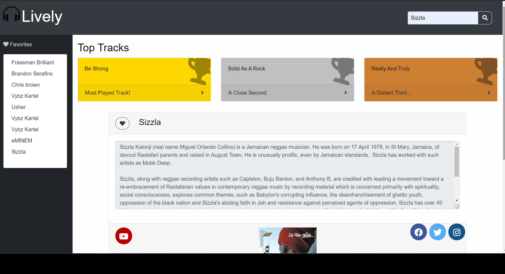
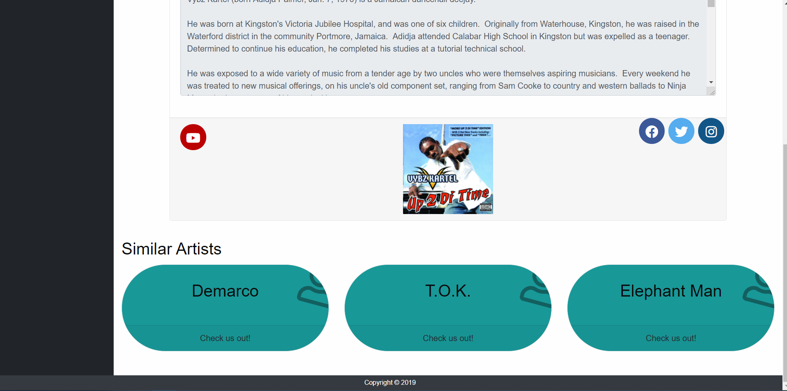

# Lively
One place to find your favorite artist and new ones at the same time.

## User Story

As a music listener 

I want to know artist top tracks and similar artist

So I can listen to song I love but also want to discover new artist at the same time.

### Description 

This application works by having the user enter a artist name and Lively makes 5 different api calls from 2 sites; https://www.last.fm/api/, and https://tastedive.com/read/api. The first three calls from last.fm api get artist Bio, Top Tracks, Top Albums, and the last call tastedive gathers similar artists and youtube videos.

#### Installation/Usage

Pressing the search button, or hitting enter will take the value of the search bar and use it as our keyterm for searching.
 Search a band name to display: Band image - Band name and a brief bio, a list of top songs, a link to a youtube video to have embedded and then a list of similar artists.
Last FM will retrieve top songs for the band, band Bio, and band picture. TasteDive will retrieve similar artists and youtube videos.

